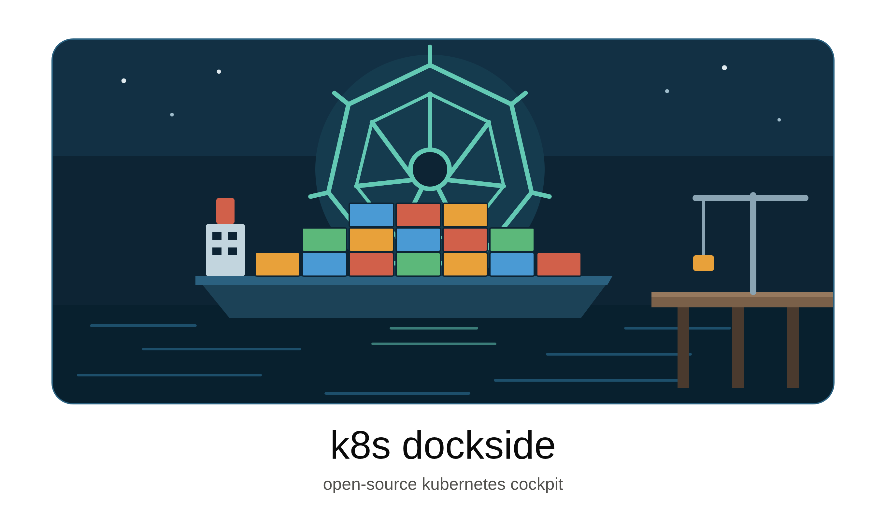

<div align="center">



**Every cluster in your kubeconfig, in one window.**

[](https://github.com/rogerwesterbo/k8sdockside/actions/workflows/ci.yml)
[](https://github.com/rogerwesterbo/k8sdockside/releases/latest)
[](LICENSE)


</div>

<!-- Screenshots go here. A dark-theme shot of the workspace with two coloured
     contexts open, and one of the YAML editor in the dock, would carry this
     README further than any paragraph below it. -->

## What it is

K8s Dockside is a desktop app for the Kubernetes clusters you already have
access to. It reads the kubeconfigs on your machine, lists every context in a
sidebar, and opens each resource view as a tab.

The point is knowing where you are. Every context gets a name and a colour you
choose, and its tabs are painted in it — so the window tells you at a glance
whether you are about to delete a pod in staging or in production. Nothing is
polled: tables are backed by live watches, so a rollout repaints as it happens.

It is a single native binary — no cluster-side agent, no browser tab, no
credentials leaving your machine. Free and open source under Apache 2.0.

## Why you might want it

- **Many clusters, one window.** Not one terminal per context and a mental note
  about which is which.
- **Colour as a safety rail.** Production is red because you made it red, and
  every tab, dock and detail panel belonging to it stays red.
- **Live, not refreshed.** Informer-backed tables. No refresh button, because
  there is nothing to refresh.
- **Your CRDs are first-class.** Everything goes through the dynamic client, so
  a custom resource opens in a tab with the same columns `kubectl get` prints,
  read from the CRD itself.
- **It reads your kubeconfig, and only reads it.** Names and colours are stored
  in the app's own settings; your kubeconfig files are never modified. Nothing
  dials a cluster at launch. The one thing it does reach out to is GitHub's
  releases page, to tell you when a newer version is out — and that can be
  switched off.

## Install

Grab the build for your platform from the
[latest release](https://github.com/rogerwesterbo/k8sdockside/releases/latest).

### macOS

Download the `.dmg` — `darwin-arm64` for Apple Silicon, `darwin-amd64` for
Intel — and drag **K8s Dockside** into Applications.

The app is not yet notarised, so macOS will say it cannot be checked on first
launch. Right-click it and choose **Open**, or:

```sh
xattr -dr com.apple.quarantine "/Applications/k8sdockside.app"
```

### Windows

Run the `-installer.exe`. It is unsigned, so SmartScreen warns once —
**More info → Run anyway**. The `.zip` holds the bare `.exe` if you would rather
not install anything.

### Linux

Needs GTK 4 and WebKitGTK 6 at runtime. The packages declare that dependency;
the AppImage expects it present.

```sh
# Debian / Ubuntu
sudo apt install ./k8sdockside-<version>-linux-amd64.deb

# Fedora / RHEL
sudo dnf install ./k8sdockside-<version>-linux-amd64.rpm

# Arch
sudo pacman -U ./k8sdockside-<version>-linux-amd64.pkg.tar.zst

# Anywhere else
chmod +x k8sdockside-<version>-linux-amd64.AppImage
./k8sdockside-<version>-linux-amd64.AppImage
```

### Verifying what you downloaded

Every release ships `checksums.txt`, a cosign signature over it, and SLSA build
provenance for each asset:

```sh
sha256sum -c --ignore-missing checksums.txt
gh attestation verify <file> --repo rogerwesterbo/k8sdockside
```

The full recipe, including `cosign verify-blob`, is in
[SECURITY.md](SECURITY.md#verifying-a-download).

### From source

See [docs/development.md](docs/development.md).

## Getting started

1. **Launch it.** It finds `~/.kube/config`, everything in `$KUBECONFIG`, and
   anything else under `~/.kube` that parses as a kubeconfig. Nothing connects
   yet.
2. **Add anything it missed.** Point it at a file, or at a whole folder — a
   watched folder is scanned regardless of how the files in it are named, and
   rescanned on **Sync**.
3. **Name and colour your contexts.** Select one, then use the panel at the foot
   of the sidebar. This is the step worth doing properly; it is what makes the
   rest of the window readable.
4. **Open a view.** Pick a kind under a context and it opens as a tab in that
   context's colour. The watch starts here.
5. **Click a row.** The describe panel slides in. From there: **Edit** for live
   YAML, **Shell** for a terminal in the container, **Forward** for a port
   forward, **Logs** for the log stream.

## Features

**Clusters and contexts**
- Discovers kubeconfigs from `~/.kube/config`, `$KUBECONFIG` and `~/.kube`
- Watched folders, scanned by content rather than by filename
- Per-context alias and colour, carried through tabs, dock and panels
- Hide a discovered file, or forget one you added, and bring it back later
- Hide a single context from its row in the sidebar — the file and its other
  contexts stay, the kubeconfig is not written, and it is listed under
  *Hidden* until you want it back
- A file that fails to parse is listed with the reason, not silently dropped

**Resources**
- Live informer-backed tables — no polling, no refresh button
- One watch per kind per context, shared by every tab using it
- Namespace filtering applied to the cache, so it repaints instantly
- CRDs, the Gateway API and built-in kinds on one dynamic-client code path
- Columns read from the CRD's `additionalPrinterColumns`, so tables match
  `kubectl get`
- A dashboard of cluster capacity, requests and workload health

**Working with objects**
- A describe panel you can dock right, bottom or left, and resize
- YAML editing in the dock: live document, syntax checking, `⌘S` to save
- Conflict-safe writes — a save against a moved object is refused, not forced,
  and the API server's own words come back
- Object actions: scale, restart, cordon, drain, delete
- Log streaming, per container

**Terminals and networking**
- A shell in any container, in the dock or in your own terminal emulator
- A shell on a *node*, via the same privileged pod `kubectl debug` would create,
  cleaned up when the terminal closes
- Port forwarding for pods and services, with the service-port-to-pod-port
  resolution done for you
- Forwards listed where you can stop them, and remembered between sessions as
  requests rather than live connections

**Extending it**
- Built-in **Plugins** for Argo CD, Flux and Prometheus — each unfolds into
  its own views instead of scattering custom resources through the definitions
  tree, with an overview of whether the cluster actually has it
- A plugin is a JSON file naming kinds the app already knows how to show, so
  supporting your own operator is a file, not a fork —
  [docs/plugins.md](docs/plugins.md)
- Graphs where the cluster can answer for them: Prometheus is found
  automatically and reached *through the API server*, no port-forward and no
  second credential. The queries live in the plugin file.
- 13 built-in themes, from `K8s Dockside Dark` through `Deep Sea` and
  `Lighthouse` to ports of Nord and Catppuccin Mocha. A theme is a JSON file of
  colours — it cannot ship CSS or run code —
  [docs/themes.md](docs/themes.md)

**Details that matter**
- A bell in the title bar says when a new release is out, and can be marked as
  read — one request to GitHub shortly after launch and every six hours, off
  under *Settings → Behaviour*, with a check-now button under *About*. It
  offers the release page, and the download for the way this build was
  installed (AppImage, `.deb`, `.rpm`, Arch package, `.dmg`, Windows
  installer or portable) when the release has one
- Secrets are redacted before they enter the informer cache; tables show key
  counts only
- Tabs and dock contents are restored next launch, and a tab with unsaved
  changes wears a dot instead of its close button
- Client certificates, tokens and `exec` credential plugins all work — it is
  `clientcmd` underneath

## Where your things live

Settings go to `$XDG_CONFIG_HOME/k8sdockside/settings.json` (falling back to
`~/.config/...`) on macOS and Linux, and `%AppData%` on Windows. The exact path
is shown in the status bar. Themes and plugins you install sit in `themes/` and
`plugins/` folders beside it.

## Documentation

- [Architecture](docs/architecture.md) — how the cluster data gets here, and the
  code layout
- [Development](docs/development.md) — building, testing, and cutting a release
- [Themes](docs/themes.md) — the theme format
- [Plugins](docs/plugins.md) — the plugin format

## Contributing

Issues and pull requests are welcome. CI runs build, test, lint and security
scans on every push; `make audit` runs the same security checks locally.

Security issues: please see [SECURITY.md](SECURITY.md) rather than opening a
public issue.

## License

[Apache License 2.0](LICENSE).

Built with [Wails v3](https://v3.wails.io/) and [Svelte 5](https://svelte.dev/).
